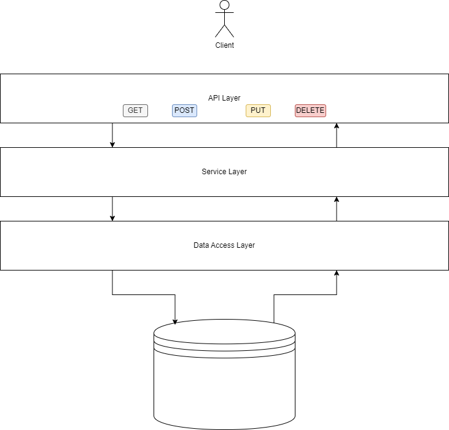

---
layout:
  title:
    visible: true
  description:
    visible: false
  tableOfContents:
    visible: true
  outline:
    visible: true
  pagination:
    visible: true
---

# Project Overview

In the realm of Spring Boot applications, understanding the foundational layers is key to structuring robust and scalable software. At its core, a Spring Boot application comprises three primary layers, each serving a distinct purpose in the application's architecture.

<figure><figcaption>
Spring Boot Layers
</figcaption></figure>

1. **API Layer:** The API Layer serves as the entry point for incoming requests, responsible for handling various HTTP methods such as GET, POST, PUT, and DELETE. These requests are received and processed by the API Layer, which acts as the interface between external entities and the application itself. This layer's primary function involves managing and routing incoming requests to the appropriate endpoints within the application.
2. **Service Layer:** Sitting atop the API Layer, the Service Layer encapsulates the business logic of the application. It functions as the core component responsible for executing the application's specific functionalities and business rules. Here, complex operations, computations, and manipulations on the data received from the API Layer are performed. This layer essentially orchestrates and executes the tasks necessary to fulfill the requirements of the application.
3. **Data Access Layer:** The Data Access Layer, often abbreviated as DAL, acts as the bridge between the application and the underlying database systems. Its primary role is to facilitate the interaction with the chosen database(s) based on the application's specific requirements. The DAL abstracts the complexity of data retrieval, storage, and manipulation by providing a unified interface for accessing and modifying data. This layer allows seamless integration with various databases, catering to the application's data storage needs without exposing the underlying database intricacies to the upper layers.

The API Layer's function revolves around handling incoming requests and directing them to the appropriate endpoints, while the Service Layer manages the application's business logic. Meanwhile, the Data Access Layer connects the application to the designated database(s) and facilitates data operations.

By delineating these distinct layers within a Spring Boot application, developers can organize and structure their codebase efficiently. This modular approach enables better scalability, maintainability, and flexibility, allowing for easier debugging, testing, and future enhancements. Understanding the roles and interactions among these layers is fundamental to crafting well-architected Spring Boot applications that meet specific business needs and adapt to evolving requirements.
